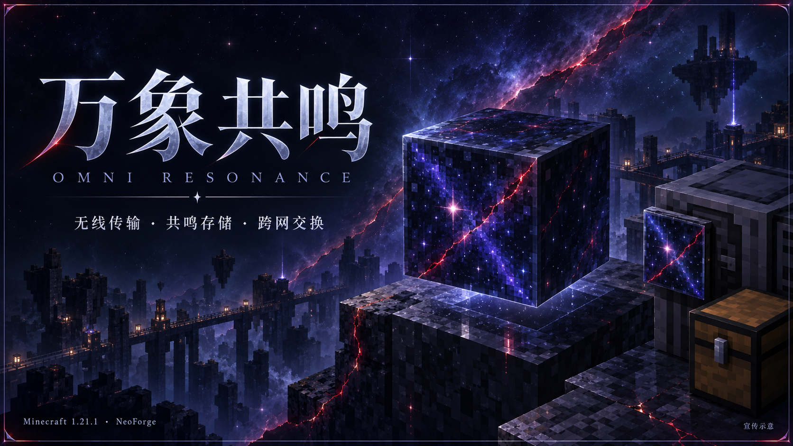
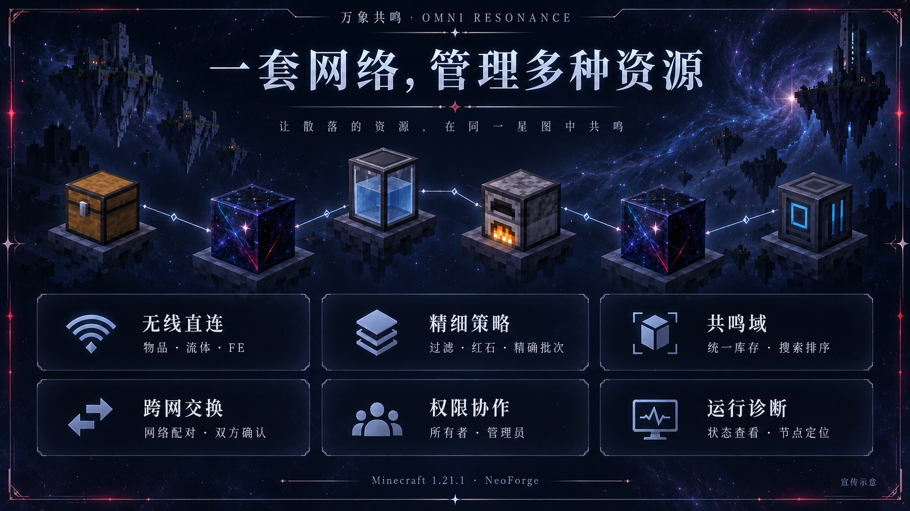
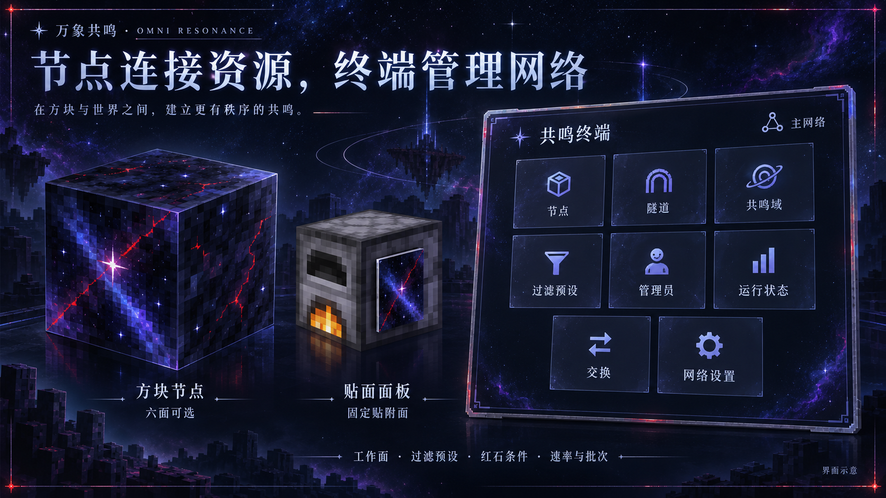
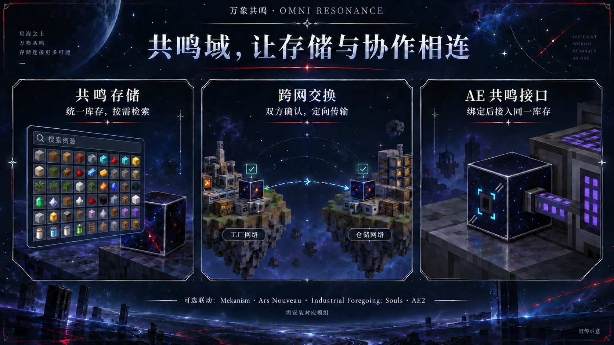

# 万象共鸣（Omni Resonance）

面向 Minecraft 1.21.1 / NeoForge 的无线跨维度物流与存储模组。当前版本为 **0.1.0-beta.1**，首批功能已完成，进入多人及长期组合测试阶段。

## 已支持的功能

- 通过节点、隧道和频道进行物品、流体、FE直连传输。
- 共鸣域统一存储、终端检索与可配置的直接存取，支持两个网络配对交换。
- 所有者与管理员权限、过滤预设、多工作面、红石条件、保留量、速率与精确批次。
- 节点强加载、高亮、需要OP的传送，以及运行诊断。
- 可选联动：Mekanism化学品、Ars Nouveau魔源、Industrial Foregoing: Souls监守者灵魂，以及AE2共鸣域接口。
- JEI侧栏、预设拖放与标签复制；EMI仅支持标签复制。

展开功能、节点与联动介绍

以下为宣传插画与界面示意。

## 安装与使用

测试基线为 **Minecraft 1.21.1、NeoForge 21.1.248、Java 21**。将正式JAR放入`mods`目录；多人游戏的服务端和客户端安装相同版本。不要安装`-sources.jar`，替换版本时移除旧JAR。联动模组及其依赖需自行安装，不随本模组打包。

默认 **Shift+E** 打开共鸣终端，创建网络后配置节点。直达共鸣域的快捷键默认未绑定，可在控制设置中设置。方块节点选择工作面，面板节点使用贴附面。

终端直接存取默认只读。服务器可在NeoForge管理的`omniresonance-server.toml`中把`terminal.direct_storage_access`设为`read_write`。这只控制终端手动存取，不等于关闭自动物流。

共鸣域输入节点可以接受外部设备直接投递，遵守工作面、资源范围、过滤、红石和节点开关。外部投递不使用节点主动抽取的速率、间隔、保留量或批次；不能接收时将未接收资源留给调用方。普通节点不允许外部提取共鸣域库存；独立AE2接口经所有者绑定授权后可读写同一库存。

共鸣域输出和网络交换需要有效过滤预设；预设由玩家手动创建。强加载在实体节点处开启；传送还需OP权限，OP本身不会自动获得其他玩家的网络权限。

升级测试包前备份世界。已知外部模组限制不会通过绕过其侧面规则或修改其内部行为来规避；完整组合的长期验证仍在进行。

## Beta 已知问题

- 当其他管理员正在编辑频道等子对象时，删除网络会被拒绝；确认页可能未正确退回。重新打开终端，并在编辑结束后重试即可，库存和网络不会因此被删除。
- 游戏进程首次打开共鸣域时可能有短暂停顿，继续收集不同规模和整合包下的性能反馈。

反馈问题时请提供模组版本、复现步骤和相关日志；崩溃请同时提供崩溃报告。

## 开发与许可证

本项目由 OpenAI Codex（AI）负责实现；项目所有者负责提出需求、确定设计方向并进行最终审核。

本项目以 [GNU Lesser General Public License v3.0 或更高版本](LICENSE) 开源。
